# Wardro — an AI Styling Agent Built on MCP

Wardro answers the question *"What should I wear today?"* An agent checks the live weather, searches **your actual closet**, suggests an outfit, and logs what you wore.

Under the hood, it is a hands-on study of the **Model Context Protocol (MCP)**. Two independent MCP servers expose 15 tools. A FastAPI **host** runs the agent loop, and the same servers also plug straight into **Claude Desktop** and **MCP Inspector** without any code changes.

<p align="center">
  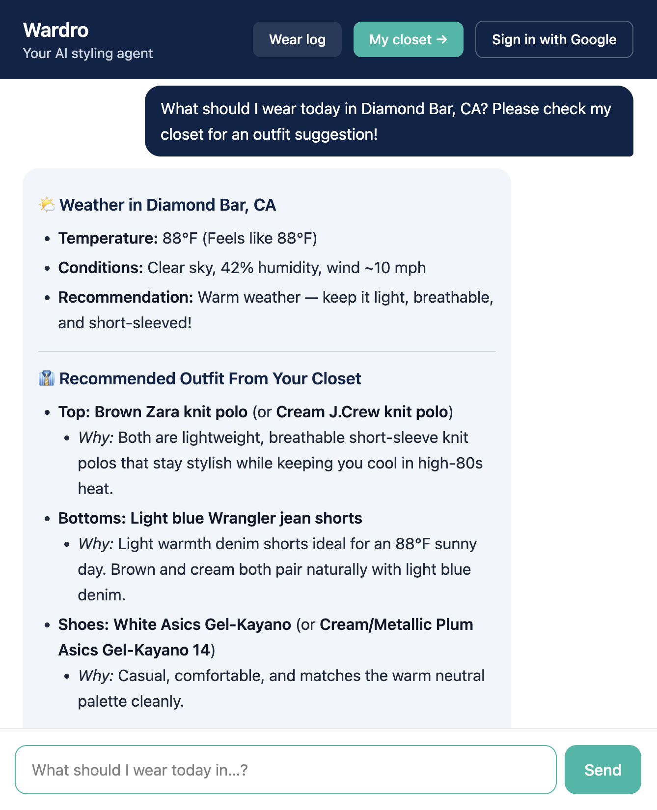
  <br><em>The Wardro web app: one question triggers geocoding, a live weather lookup, and a closet search.</em>
</p>

---

## Table of Contents

- [Overview](#overview)
- [Objectives](#objectives)
- [Architecture](#architecture)
- [How the Agent Loop Works](#how-the-agent-loop-works)
- [Demo](#demo)
- [Inside the Protocol: MCP Inspector](#inside-the-protocol-mcp-inspector)
- [Host-Agnostic: Using Claude Desktop as MCP Host](#host-agnostic-using-claude-desktop-as-mcp-host)
- [Code Highlights](#code-highlights)
- [Tech Stack](#tech-stack)
- [Setup & Run](#setup--run)
- [Project Structure](#project-structure)
- [Future Work](#future-work)
- [Author](#author)

---

## Overview

A plain Python function can only be called by code that imports it. An **MCP tool** is the same function, wrapped so that *any* AI application can:

1. **discover it** (`tools/list`, which returns its name, description, and a JSON Schema for its inputs),
2. **call it** (`tools/call`, a JSON-RPC 2.0 request over stdio or HTTP), and
3. **get a structured result back**, without knowing anything about how it is implemented.

Wardro puts that idea into practice across a full-stack app:

| Component | Role | Port |
|---|---|---|
| **Next.js frontend** | Chat UI, closet gallery, wear log, Google sign-in | 3000 |
| **FastAPI backend** (`host/`) | The **MCP host**: runs the agent loop and connects to both servers | 8080 |
| **`wardro-weather`** MCP server | 6 tools: geocoding, current weather, forecast, outfit advice, search history | 8000 |
| **`wardrobe-closet`** MCP server | 9 tools: closet inventory CRUD, color matching, wear logging | 8001 |
| **Gemini** | The LLM that decides *which* tool to call and *when* | — |

The MCP layer is **hand-rolled**. `shared/mcp_server.py` implements the server side of the protocol (JSON-RPC handling, schema generation, stdio + Streamable HTTP transports) without the `mcp` SDK or FastMCP. `host/mcp_client.py` does the same for the client side.

## Objectives

- **Understand MCP from first principles.** Implement the protocol (handshake, discovery, invocation, two transports) instead of treating an SDK as a black box.
- **Separate reasoning from execution.** The LLM only *requests* tool calls. The host executes them, and the servers own the data and external APIs.
- **Prove the servers are host-agnostic.** Run the same servers under a custom web host, MCP Inspector, and Claude Desktop.
- **Ship a usable product.** A real closet (27 photographed items), live weather, and a persistent wear history.

## Architecture

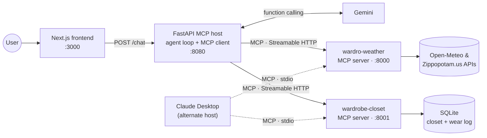

Design rules that keep the pieces independent:

- **Servers never talk to each other.** The host orchestrates across them.
- **One server per folder** (`mcp-servers/<name>/server.py`), so adding a capability means adding a folder.
- **Shared logic lives in `shared/`** (weather client, closet DB, MCP server core), giving one source of truth.
- **The LLM never touches a server directly.** Every call is brokered by the host.

## How the Agent Loop Works

<p align="center">
  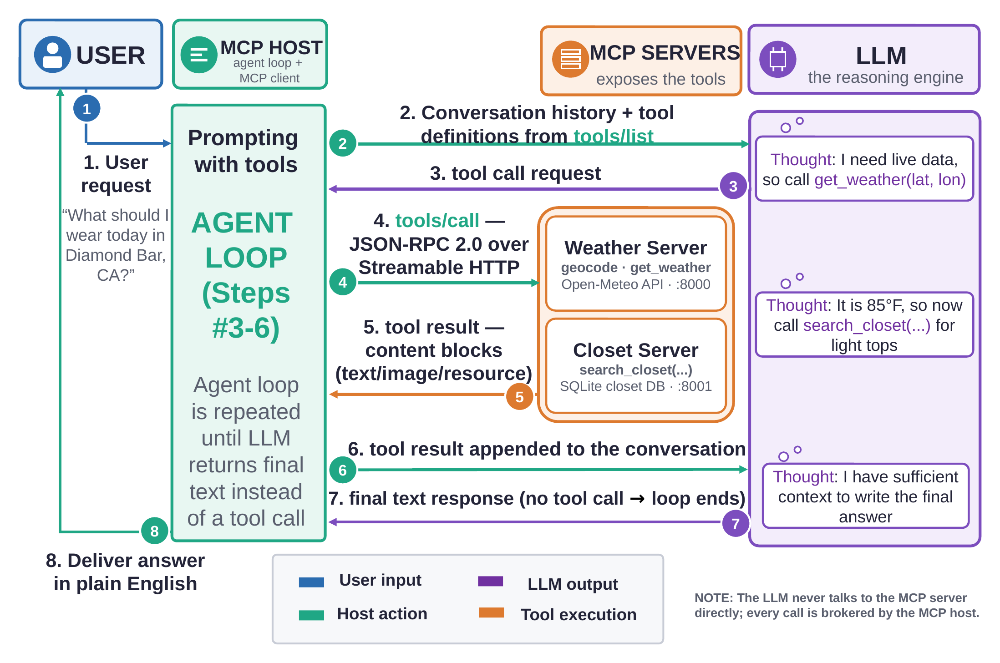
</p>

For *"What should I wear today in Diamond Bar, CA?"*:

1. The host sends the conversation plus every tool definition (from `tools/list` on **both** servers) to Gemini.
2. Gemini replies with a **tool call request**, not text: `geocode("Diamond Bar, CA")`.
3. The host routes it to the server that owns that tool (`tools/call` over JSON-RPC), then appends the result to the conversation.
4. The loop repeats: `get_weather(lat, lon)` → 88°F → `search_closet(...)` for light, short-sleeve items.
5. When Gemini finally answers with plain text instead of a tool call, the loop ends and the answer goes back to the user.

## Demo

### Web app

<table>
  <tr>
    <td width="50%">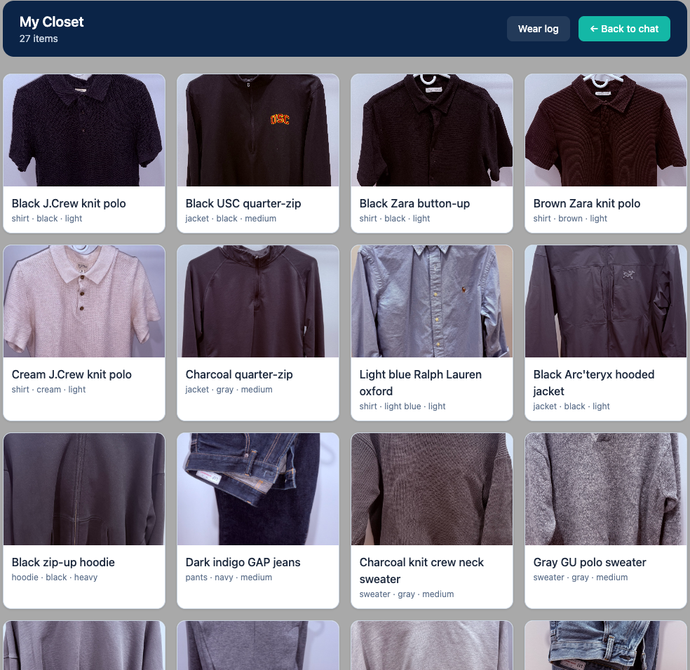</td>
    <td width="50%">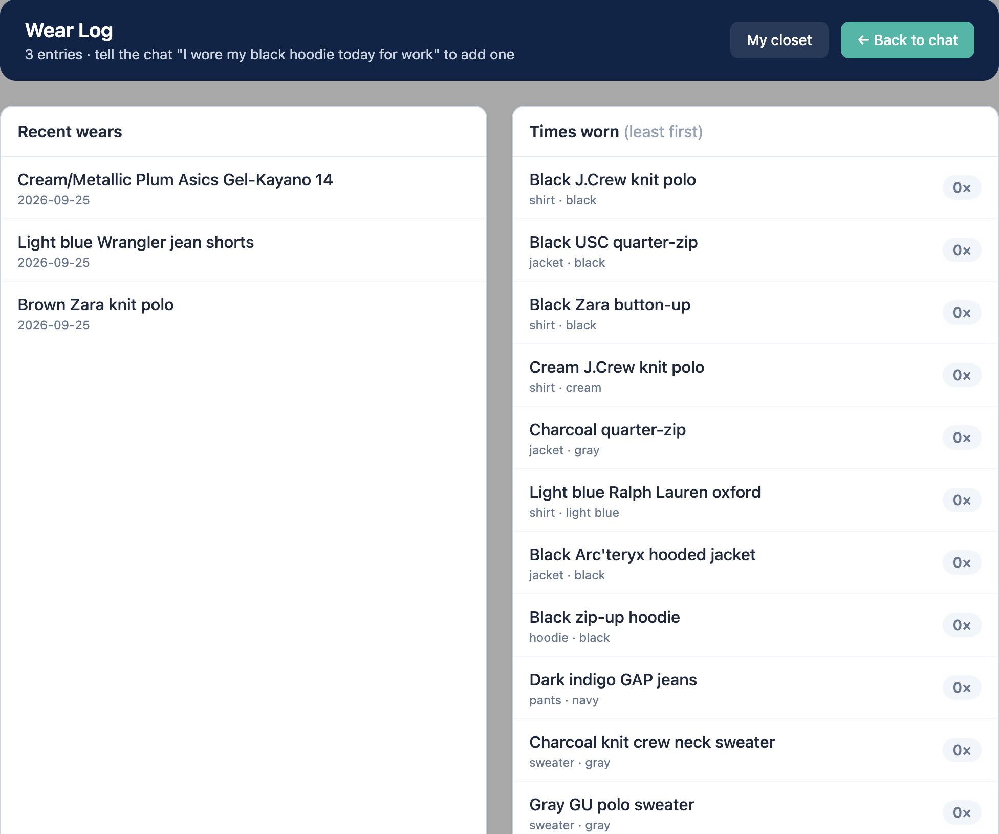</td>
  </tr>
  <tr>
    <td align="center"><em>My Closet: 27 items with photos, category, color, and warmth level.</em></td>
    <td align="center"><em>Wear Log: every <code>log_wear</code> call lands here, whichever host made it.</em></td>
  </tr>
</table>

### All 15 tools, discovered at runtime

The host doesn't hard-code any tools. At startup it asks both servers for their tools and merges them. `GET /tools` shows what it found:

<p align="center">
  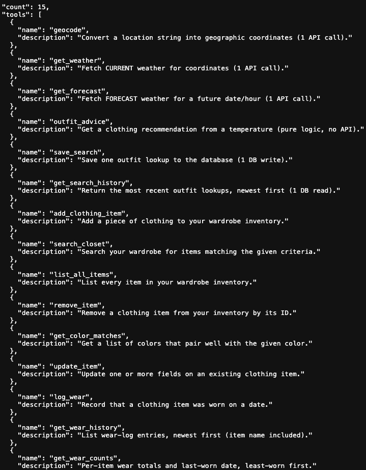
</p>

## Inside the Protocol: MCP Inspector

[MCP Inspector](https://modelcontextprotocol.io/docs/tools/inspector) connects to a server directly, with no LLM involved, so you can see the raw protocol. The **Protocol** panel shows the full lifecycle: `initialize` → `notifications/initialized` → `tools/list` → `tools/call`.

<table>
  <tr>
    <td width="50%">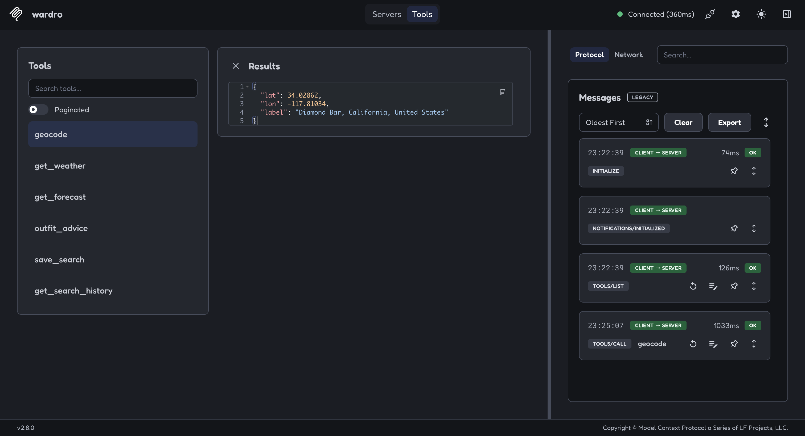</td>
    <td width="50%">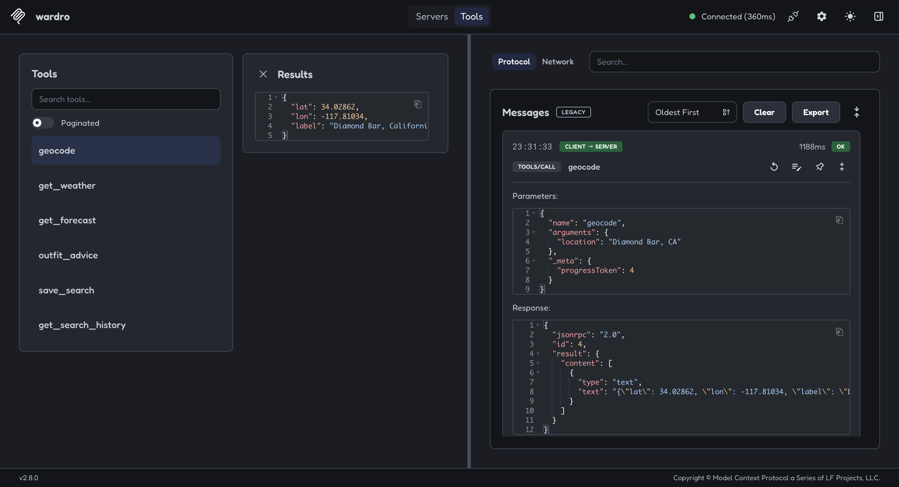</td>
  </tr>
  <tr>
    <td align="center"><em><code>geocode</code> turns "Diamond Bar, CA" into coordinates.</em></td>
    <td align="center"><em>The raw JSON-RPC 2.0 request and response behind it.</em></td>
  </tr>
  <tr>
    <td width="50%">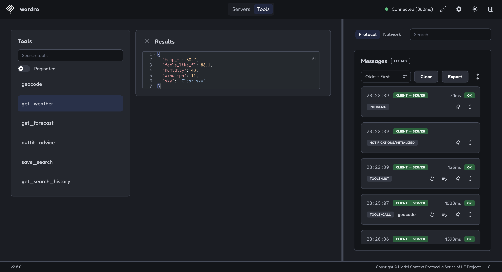</td>
    <td width="50%">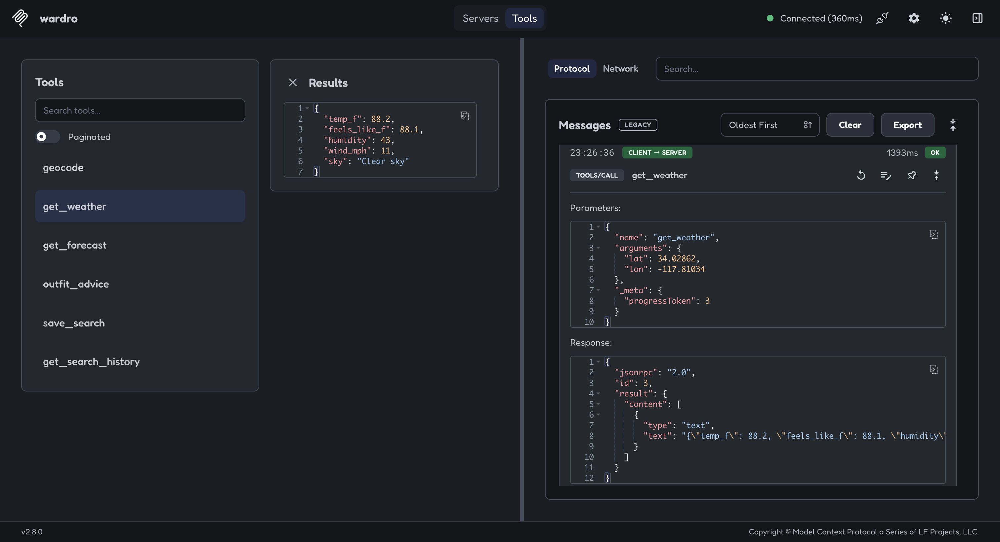</td>
  </tr>
  <tr>
    <td align="center"><em><code>get_weather</code> is called with those coordinates.</em></td>
    <td align="center"><em>The result comes back as MCP <code>content</code> blocks.</em></td>
  </tr>
</table>

<details>
<summary><strong>More: <code>search_closet</code> on the closet server</strong></summary>
<br>
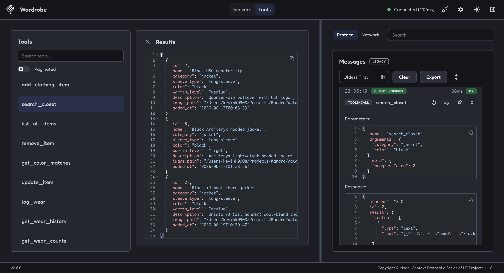
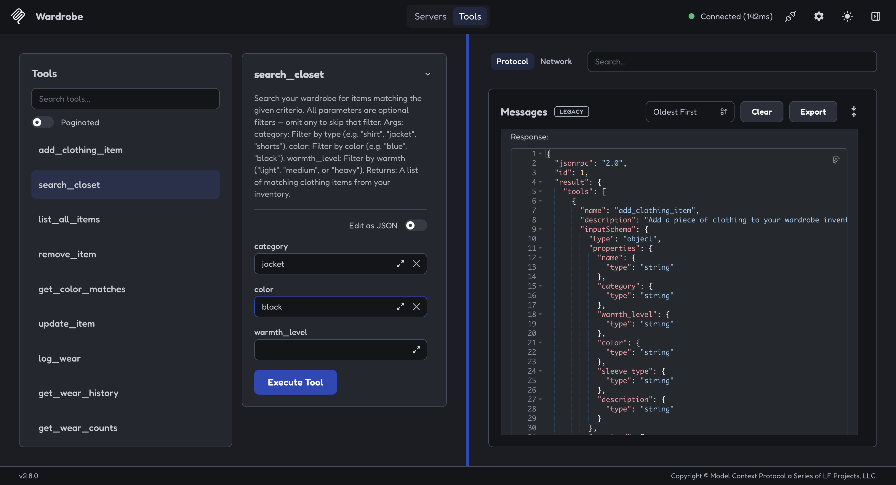
</details>

## Host-Agnostic: The Same Servers in Claude Desktop

The same `server.py` files run unchanged inside **Claude Desktop**. The only difference is the transport: Claude Desktop launches each server itself and talks over **stdio**, while the web backend connects over **Streamable HTTP**.

<table>
  <tr>
    <td width="50%">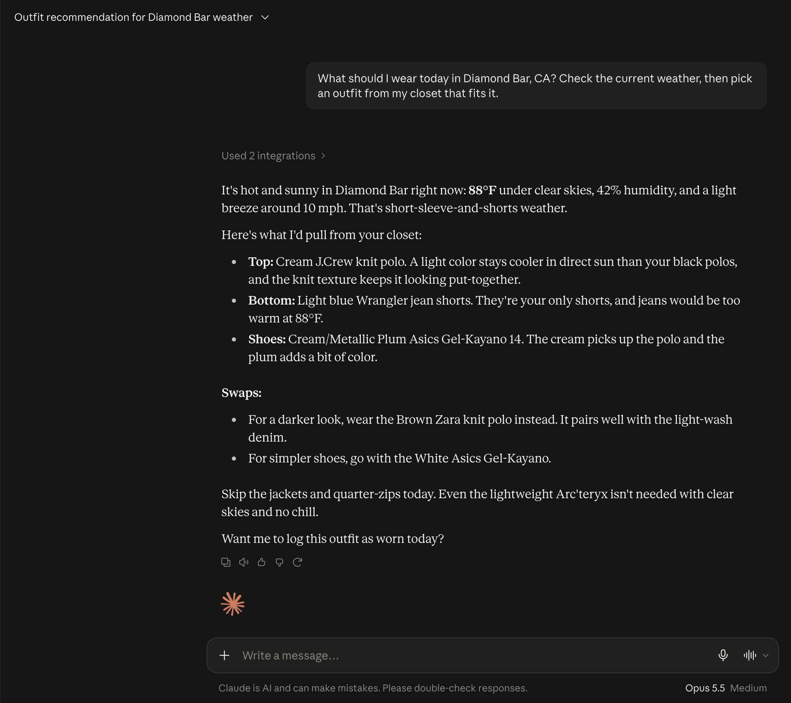</td>
    <td width="50%">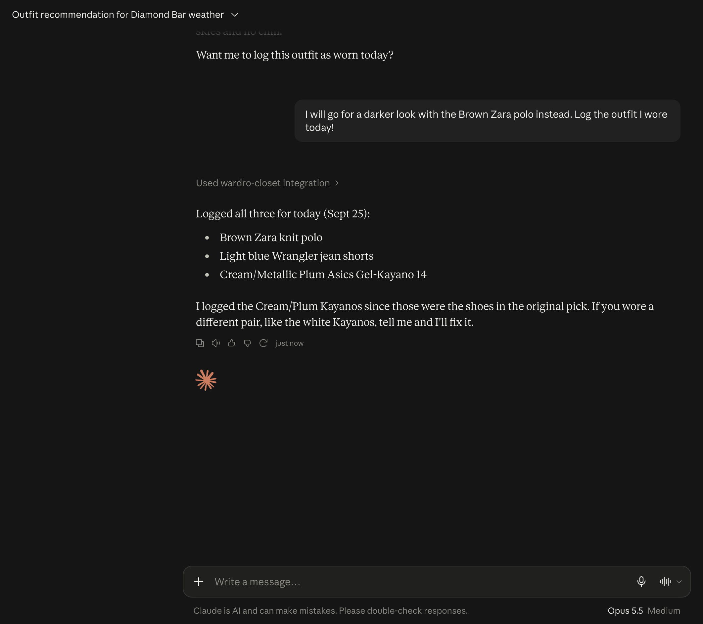</td>
  </tr>
  <tr>
    <td align="center"><em>Same question, different host: Claude uses both Wardro servers.</em></td>
    <td align="center"><em>Claude calls <code>log_wear</code>, which writes to the same SQLite DB the web app reads.</em></td>
  </tr>
</table>

<details>
<summary><strong>More: Claude Desktop asks before every tool call</strong></summary>
<br>
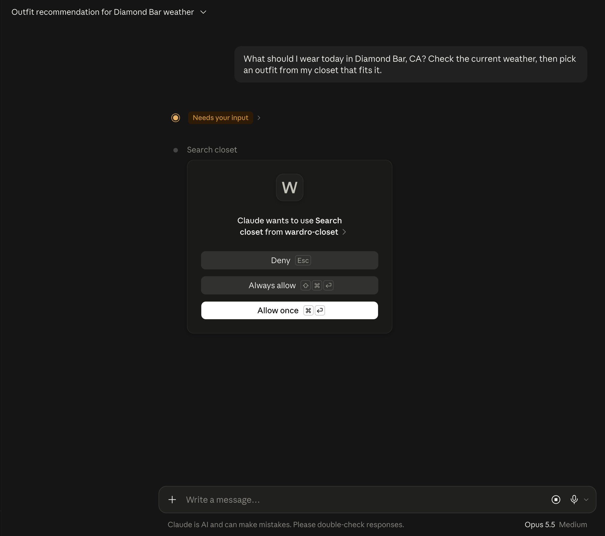
</details>

The outfit Claude Desktop logged shows up in the web app's wear log, **written by one host and read by another** through the same MCP server:

<p align="center">
  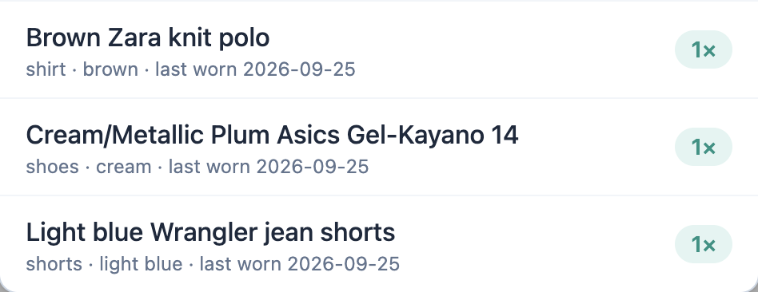
</p>

## Code Highlights

**1. A tool is a normal Python function plus a decorator.** The type hints and docstring become the JSON Schema and description the LLM reads.

```python
# mcp-servers/wardrobe-closet/server.py
@mcp.tool()
def search_closet(category: str = "", color: str = "", warmth_level: str = "") -> list[dict]:
    """Search your wardrobe for items matching the given criteria.

    Args:
        category: Filter by type (e.g. "shirt", "jacket", "shorts").
        color: Filter by color (e.g. "blue", "black").
        warmth_level: Filter by warmth ("light", "medium", or "heavy").
    """
    return wardrobe.search_items(category=category, color=color, warmth_level=warmth_level)
```

**2. The protocol, hand-rolled.** The core of `MiniMCP` is a small dispatcher that both transports share.

```python
# shared/mcp_server.py
def _handle(self, method, params):
    if method == "initialize":
        return {"protocolVersion": params.get("protocolVersion", "2025-06-18"),
                "capabilities": {"tools": {}},
                "serverInfo": {"name": self.name, "version": "0.1.0"}}
    if method == "tools/list":
        return {"tools": [{"name": n, "description": t["description"], "inputSchema": t["schema"]}
                          for n, t in self._tools.items()]}
    if method == "tools/call":
        result = self._tools[params["name"]]["func"](**(params.get("arguments") or {}))
        text = result if isinstance(result, str) else json.dumps(result)
        return {"content": [{"type": "text", "text": text}]}
```

**3. One server, two transports.** The same tools can be served over HTTP or stdio.

```python
if __name__ == "__main__":
    if "--stdio" in sys.argv:
        mcp.run()                 # stdio: Claude Desktop launches this script
    else:
        mcp.run_http(port=8001)   # Streamable HTTP: the web backend connects to :8001/mcp
```

**4. The host connects to both servers and hands their tools to the agent.**

```python
# host/backend.py
SERVERS = {
    "wardro":   {"url": "http://127.0.0.1:8000/mcp", "transport": "streamable_http"},
    "wardrobe": {"url": "http://127.0.0.1:8001/mcp", "transport": "streamable_http"},
}
client = MultiServerMCPClient(SERVERS)
tools  = await client.get_tools()            # MCP tool schemas -> LLM function declarations
agent  = create_agent(model, tools, system_prompt=system_prompt())
```

> `host/host.py` is an alternative host with **no LangChain**. It uses a hand-written MCP client (`host/mcp_client.py`), its own MCP→Gemini schema conversion, and its own `while` loop for the agent.

## Tech Stack

| Layer | Tools |
|---|---|
| **Protocol** | Model Context Protocol (JSON-RPC 2.0 over stdio and Streamable HTTP), implemented from scratch |
| **LLM** | Google Gemini (`langchain-google-genai`), with model fallback and retry middleware |
| **Host / backend** | Python, FastAPI, Uvicorn, LangChain `create_agent`, `langchain-mcp-adapters` |
| **Frontend** | Next.js 15, React 19, Tailwind CSS v4, Auth.js (Google OAuth), `react-markdown` |
| **Data & APIs** | SQLite, Open-Meteo (geocoding + forecast), Zippopotam.us |
| **Tooling** | MCP Inspector, Claude Desktop |

## Setup & Run

**Prerequisites:** Python 3.11+, Node 18+, and a free [Gemini API key](https://aistudio.google.com/apikey).

```bash
git clone https://github.com/kevink0908/Wardro.git && cd Wardro
python3 -m venv .venv && source .venv/bin/activate
pip install -r requirements.txt
cd frontend && npm install && cd ..
```

Secrets (never committed):

- `.env` at the project root: `GEMINI_API_KEY=...`
- `frontend/.env.local`: `AUTH_SECRET`, `AUTH_GOOGLE_ID`, `AUTH_GOOGLE_SECRET` (only needed for Google sign-in)

Run the four processes, each in its own terminal from the project root:

```bash
python mcp-servers/wardro-weather/server.py               # 1) weather MCP server  :8000
python mcp-servers/wardrobe-closet/server.py              # 2) closet MCP server   :8001
uvicorn backend:app --reload --port 8080 --app-dir host   # 3) MCP host / agent    :8080
cd frontend && npm run dev                                # 4) web app            :3000
```

Open **http://localhost:3000**. Other useful URLs: `localhost:8080/docs` (API explorer) and `localhost:8080/tools` (every tool the host discovered).

<details>
<summary><strong>Inspect a server with MCP Inspector</strong></summary>

```bash
npx @modelcontextprotocol/inspector
```

Add a server with transport **Streamable HTTP** and URL `http://127.0.0.1:8000/mcp` (or `:8001/mcp`), connect, then open **Tools**.
</details>

<details>
<summary><strong>Use the servers from Claude Desktop</strong></summary>

In **Settings → Developer → Edit Config**, add the following (use absolute paths), then restart Claude Desktop:

```json
{
  "mcpServers": {
    "wardro-weather": {
      "command": "/ABSOLUTE/PATH/Wardro/.venv/bin/python",
      "args": ["/ABSOLUTE/PATH/Wardro/mcp-servers/wardro-weather/server.py", "--stdio"]
    },
    "wardro-closet": {
      "command": "/ABSOLUTE/PATH/Wardro/.venv/bin/python",
      "args": ["/ABSOLUTE/PATH/Wardro/mcp-servers/wardrobe-closet/server.py", "--stdio"]
    }
  }
}
```
</details>

<details>
<summary><strong>Terminal agents (no web app needed)</strong></summary>

With only the two MCP servers running:

```bash
python agents/wardro-stylist/agent.py   # daily outfit stylist in the terminal
python agents/trip-planner/agent.py     # multi-day trip packing planner
```
</details>

## Project Structure

```
Wardro/
├── frontend/                 # Next.js app: chat, /closet, /wear-log, Google sign-in
├── host/
│   ├── backend.py            # MCP host (LangChain agent + MultiServerMCPClient)
│   ├── host.py               # alternative host: no LangChain, hand-rolled loop
│   └── mcp_client.py         # hand-rolled MCP client (JSON-RPC over HTTP)
├── mcp-servers/
│   ├── wardro-weather/       # 6 tools: geocode, get_weather, get_forecast, ...
│   └── wardrobe-closet/      # 9 tools: search_closet, log_wear, get_wear_counts, ...
├── agents/                   # terminal agents reusing the same two servers
├── shared/
│   ├── mcp_server.py         # MiniMCP: MCP server from scratch (stdio + HTTP)
│   ├── wardro_core.py        # weather API client + search history DB
│   └── wardrobe.py           # closet + wear-log DB
├── data/                     # SQLite DBs + clothing photos
└── docs/images/              # README screenshots
```

## Future Work

- **Deploy the servers remotely** over HTTPS with OAuth, so they work as Claude custom connectors.
- **Vision-based closet intake:** photograph an item and let the model fill in its category, color, and warmth.
- **Rotation-aware suggestions:** use `get_wear_counts` to favor items you haven't worn recently.
- **Adopt the 2026-07-28 MCP spec** (the servers currently speak the earlier protocol version).

## Author
Kevin Kim  
M.S. Candidate, Computer Science – Artificial Intelligence  
USC Viterbi School of Engineering
